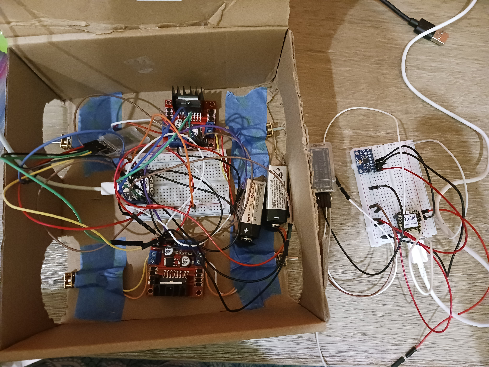

# boxcar

An RC Car with 2 pro micros nrf52840, 2 l9n28 motor drivers, 4 dc motors, 1 adxl345 (accelerometer), 1 amp, and one speaker. 

Circuitpython within the current model does not work always.
It is a box car that is controlled using a module on a glove. Tilting the hand make the car go in that direction. Read JOURNAL.md for more info about the process.

Things we learned:
- test first
- wait no CAD FIRST cuz lines get long
- work, but don't compromise sleep + brainpower
- a ton about electronics and pinouts and NRF52840s

Pics in the Process:
.jpg>) 

.jpg>) 

.jpg>)
